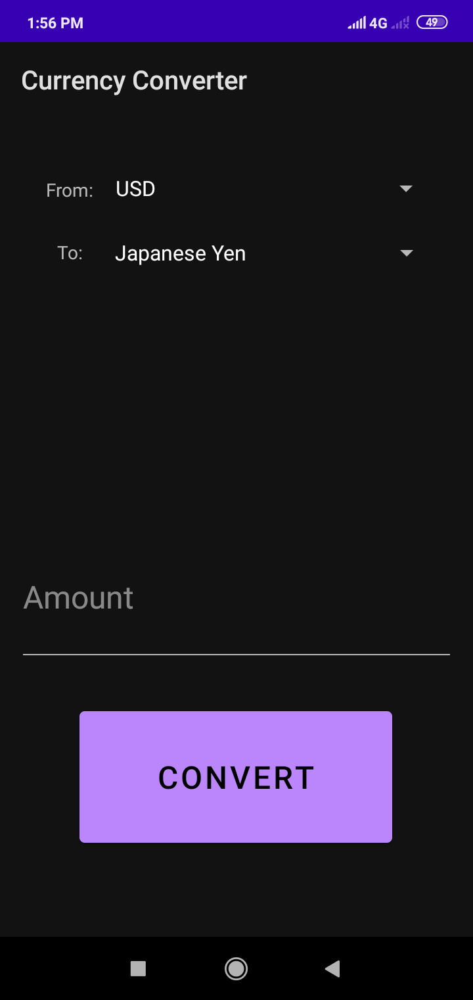

# CurrencyConverter
Currency converter android application.

## Supported currencies
Bangladeshi Taka(BDT), Canadian Dollar, Chinese Yuan, Euro, Indian Rupee,
Jamaican Dollar, Japanese Yen, United States Dollar(USD)

Screenshots:

 

Goals:

- [x] Improve user interface
- [ ] Support all currencies

This is just a hobby project :)
